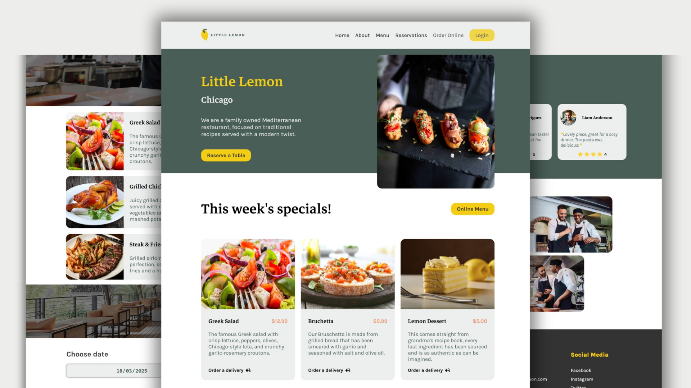

# Little Lemon 🍋

A front-end React project for a restaurant called **Little Lemon**. This is the capstone project for Meta’s Front-End Developer Professional Certificate.

## Live Preview 🌍

🔗 [Live Demo](https://little-lemon-by-beniamin.vercel.app)

## Features ✅

1. Browse the restaurant menu
2. Make an online table reservation (with form validation)
3. Responsive design for mobile & desktop
4. Performance optimizations with lazy loading

## Mockup 📸

## What I Learned 📚

1️⃣ **React Hooks & State Management:**
   - Used `useNavigate`, `useReducer`, and `useState` for state and navigation.

2️⃣ **Performance Optimizations:**
   - Implemented **React Suspense** + `lazy()` for dynamic imports.
   - Used **lazy loading** for images (`loading="lazy"`).

3️⃣ **Data Handling:**
   - Created a `menu.js` file and iterated over it using `.map()` and `.filter()`.

4️⃣ **Routing & Layout:**
   - Used `Outlet` from `react-router-dom` for a structured layout.

5️⃣ **Form Handling & Validation:**
   - Implemented validation for reservation forms.
   - Handled form submission errors & displayed user-friendly messages.

6️⃣ **Version Control & Deployment:**
   - Used **Git & GitHub** for version control.
   - Deployed the project on **Vercel**.

7️⃣ **CSS Best Practices:**
   - Defined **CSS variables** in `index.css` for branding styles.
   - Optimized styles for a **responsive & mobile-friendly** layout.

## Technologies Used 🛠️

- ✅ Semantic HTML Tags
- 🎨 Pure CSS + Variables
- ⚛️ React Framework
- 🌐 react-router-dom
- 🚀 Vercel

## Conclusion 🎉

Developed by **Beniamin Hekimian**.

Contact for feedback! ✉️